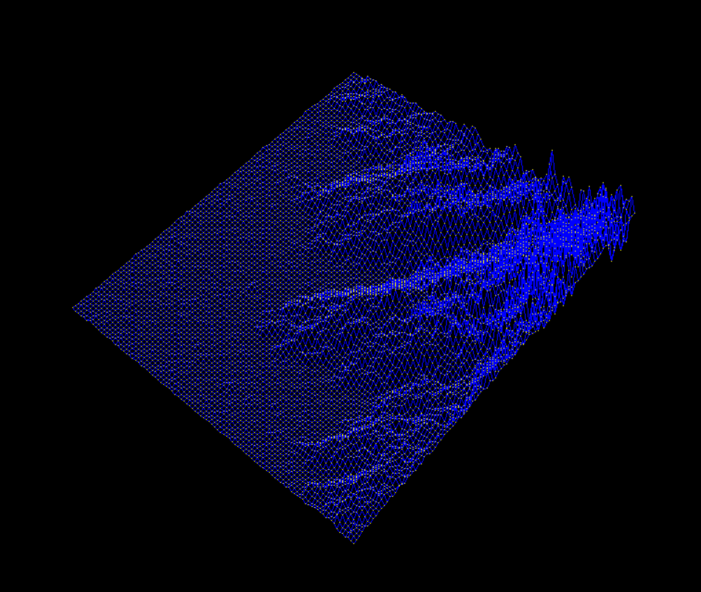
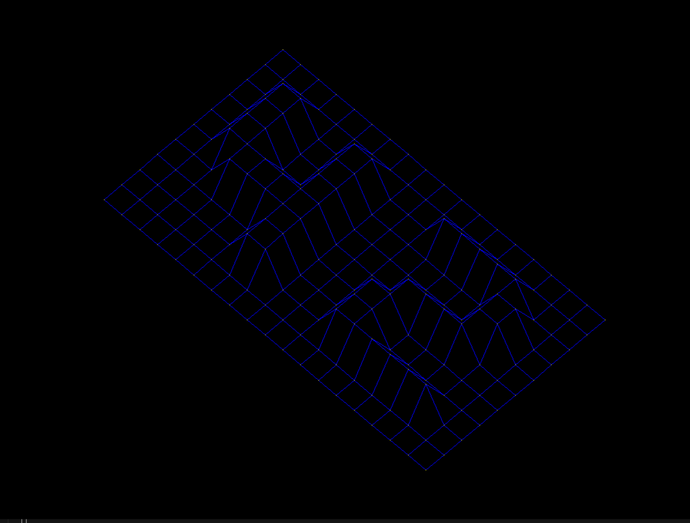

*This project has been created as part of the 42 curriculum by kalhanaw.*

# FdF



A wireframe 3D landscape renderer. Reads a `.fdf` heightmap file and displays it as an isometric wireframe using MiniLibX, written in C.

## 🚀 About

FdF (*fil de fer* — French for "wireframe") parses a grid of altitude values from a file and renders the corresponding 3D landscape in a window. Points are connected by line segments drawn with Bresenham's algorithm, projected in isometric view, and auto-fitted to the window.

## 📝 How to Build

```bash
# Build the project
make

# Run with a map file
./fdf test_maps/42.fdf
```

## 🎮 Controls

| Key / Action | Effect |
|---|---|
| `ESC` | Exit |
| Window close `X` | Exit |

## 🗂️ Map File Format

Each number represents an altitude. Column = x, row = y, value = z:

```
0  0  0  0  0  0  0  0  0  0  0  0  0  0  0  0  0  0  0
0  0  0  0  0  0  0  0  0  0  0  0  0  0  0  0  0  0  0
0  0 10 10  0  0 10 10  0  0  0 10 10 10 10 10  0  0  0
0  0 10 10  0  0 10 10  0  0  0  0  0  0  0 10 10  0  0
0  0 10 10  0  0 10 10  0  0  0  0  0  0  0 10 10  0  0
0  0 10 10 10 10 10 10  0  0  0  0 10 10 10 10  0  0  0
0  0  0 10 10 10 10 10  0  0  0 10 10  0  0  0  0  0  0
0  0  0  0  0  0 10 10  0  0  0 10 10  0  0  0  0  0  0
0  0  0  0  0  0 10 10  0  0  0 10 10 10 10 10 10  0  0
0  0  0  0  0  0  0  0  0  0  0  0  0  0  0  0  0  0  0
0  0  0  0  0  0  0  0  0  0  0  0  0  0  0  0  0  0  0
```
